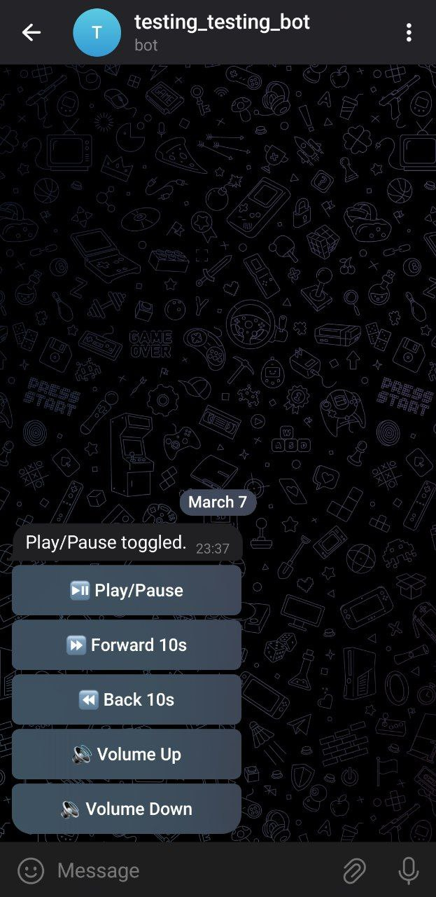

# Remote Media Control Bot

A Telegram bot to control media playback on your laptop, especially when connected to a TV or projector.

## Features
- Play/Pause media.
- Skip forward/backward by 10 seconds.
- Adjust volume up/down.

## Requirements
- Python 3.x
- `python-telegram-bot` library
- macOS (for AppleScript support)

## Installation
1. Clone the repository:
   ```bash
   git clone https://github.com/yourusername/remote-media-control-bot.git
   
## Screanshot
