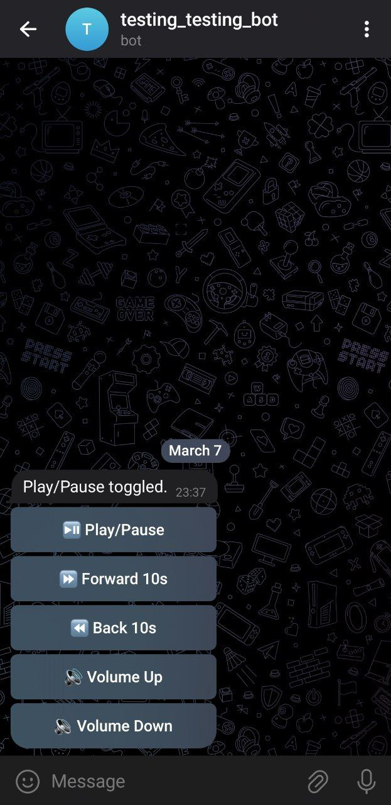

# Remote Media Control Bot

A small Telegram remote for media playing on a Mac, intended for situations such as watching a laptop connected to a TV or projector.

An early Python hobby project, published in March 2025.

## Controls

The bot sends keyboard shortcuts to the focused application through AppleScript:

| Button | Key sent |
| --- | --- |
| Play / Pause | Space |
| Forward / Back | Right / Left arrow |
| Volume Up / Down | Up / Down arrow |

The result depends on the player's shortcuts and which application has focus. The ten-second skip labels assume a player that uses those bindings.

## Setup

You need macOS, Python, and a Telegram bot token from [BotFather](https://core.telegram.org/bots#botfather). The dependency version in `requirements.txt` is from the original project.

```bash
git clone https://github.com/MushbrainR/remote-media-control-bot.git
cd remote-media-control-bot
python3 -m venv .venv
source .venv/bin/activate
python -m pip install -r requirements.txt
```

Replace `YOUR_TOKEN_HERE` in `bot.py` with your bot token, keeping it out of commits. Allow the terminal or app running the script to send keyboard events through macOS Accessibility and Automation permissions when requested.

This snapshot has no Telegram user allowlist. Anyone able to interact with the running bot can trigger its controls; add a user-ID check before using it beyond a controlled experiment.

## Use

```bash
python bot.py
```

Send `/start` to the bot in Telegram, bring your media player into focus on the Mac, and use the buttons on your phone. Keep the script running while using the remote.

## Project layout

```text
bot.py             Telegram handlers and AppleScript controls
assets/            Screenshot
requirements.txt   Python dependency
```

## Screenshot



## License

See [LICENSE](LICENSE).
